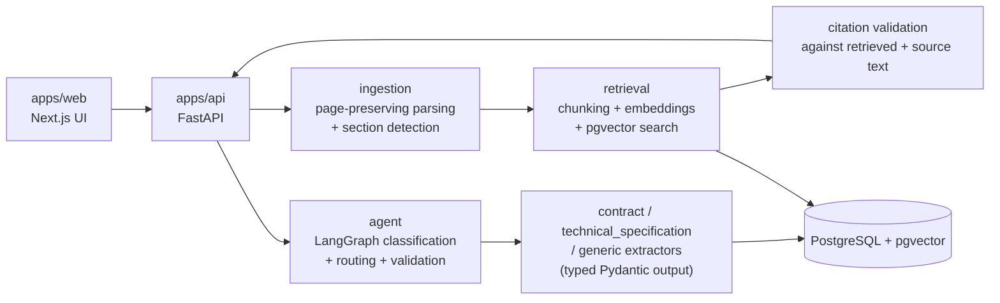

# DocuLens

DocuLens turns a complex PDF — a contract, a technical specification, a long
report — into typed, evidence-backed analysis and grounded question answering,
where every claim traces back to the exact page and quote it came from. It's
not a generic PDF chatbot: uploads are classified, routed to a document-type
extractor, and validated before anything is shown.

## Why it's different

- **Typed analysis, not free text.** Extraction results are structured
  Pydantic models per document type, not an unstructured LLM response.
- **Specialized routing.** A [LangGraph](https://langchain-ai.github.io/langgraph/)
  workflow (a graph-based orchestration framework for stateful, multi-step LLM
  applications) classifies each document and routes it to a `contract`,
  `technical_specification`, or `generic` extractor, with a bounded one-time
  retry when validation fails and a low-confidence fallback to the generic
  path.
- **Evidence required, not assumed.** Page and section metadata are preserved
  from parsing through chunking, retrieval, and citation — findings and
  answers are expected to cite the page and quote they came from.
- **Citations are checked, not trusted.** Before an answer is shown, its
  cited evidence is validated against both the retrieved context and the
  original page text; unsupported claims are reported as insufficient
  evidence rather than presented as fact.
- **Retrieval-augmented Q&A, measured.** Questions are answered using
  retrieval-augmented generation (RAG) — the answer is grounded in
  passages retrieved from the document's own indexed content, and a
  deterministic evaluation harness (below) tracks retrieval and citation
  quality as a baseline rather than an assumption.

## Product experience

1. **Upload a PDF.** It's parsed page-by-page and prepared for questions and
   analysis.
2. **Ask or analyze.** Ask a direct question, or request analysis — the
   system classifies the document type and runs the matching extractor.
3. **Read the evidence.** Every finding or answer cites the page and quote it
   came from, or reports that the evidence was insufficient.

Three precomputed demo documents are seeded for exploration without an
upload, and are visibly labeled as precomputed. Local development is
unmetered; a public deployment would apply small daily quotas per anonymous
session (see [Anonymous public quotas](#anonymous-public-quotas)). No public
deployment exists yet — this repository is set up to run locally.

## Architecture at a glance



The web app never talks to the database or an LLM provider directly; it goes
through the API. Extraction and grounded Q&A both terminate in citation
validation before a result is persisted or returned. See
[`docs/architecture.md`](docs/architecture.md) for how this will grow, and
[`doculens_idea.md`](doculens_idea.md) for the original product brief this
repository implements.

## Engineering highlights

- **Conditional graph, not a fixed pipeline.** The LangGraph workflow branches
  on document type and validation outcome, with a single bounded retry for a
  failed extraction subset — state and control flow that a linear script
  can't express cleanly.
- **Evidence provenance end to end.** Page numbers and detected sections
  survive from PDF parsing through chunk metadata to the citations a user
  sees, so a citation can be checked against the source instead of taken on
  faith.
- **Provider-agnostic LLM and embedding boundaries.** Extraction, chunk
  embedding, and answer generation sit behind typed interfaces with real and
  deterministic-fake implementations, so tests never make network or provider
  calls.
- **Measured, not assumed, retrieval quality.** A vector-search baseline is
  established and evaluated before adding retrieval complexity such as
  multi-query or hybrid search — reranking is not implemented.
- **Cost-aware public access.** Anonymous usage is gated by a signed,
  cookie-based session with small daily quotas, distinct from strong identity
  or abuse prevention.

## Measured evaluation

`evals/run_baselines.py` runs a deterministic, no-network harness over
synthetic fixtures, fake embeddings, and recorded QA outputs. These are
**not live-model quality benchmarks** — they check retrieval mechanics and
citation-validation logic against fixed inputs. Full methodology and
limitations: [`docs/evaluation.md`](docs/evaluation.md).

| Suite | Cases | Prediction source | Result |
| --- | ---: | --- | --- |
| Retrieval | 9 | deterministic fake embedding | Recall@1/3/5: 0.6667 / 1.0000 / 1.0000; MRR: 0.7963 |
| Grounded QA | 7 | recorded output | Grounded success: 0.5714; citation validity: 0.6667; invalid citation rate: 0.3333 |

Classification and extraction fixtures currently exercise evaluator/validator
correctness only; no quality score is published for them yet.

## Tech stack

| Layer | Stack |
| --- | --- |
| Frontend | Next.js, React, TypeScript, Tailwind CSS |
| API | FastAPI, Alembic migrations |
| Orchestration | LangGraph, provider-agnostic LLM abstraction (OpenAI implementation) |
| Ingestion | PyMuPDF page-preserving parsing, heuristic section detection |
| Persistence & retrieval | PostgreSQL + pgvector |
| Evaluation | Deterministic offline harness (`evals/`) |

## Repository layout

- `apps/web` — Next.js user interface
- `apps/api` — FastAPI application and persistence boundary
- `agent` — LangGraph orchestration and document-specific extractors
- `ingestion` — document parsing and structure detection
- `retrieval` — chunking, embeddings, search, and citation validation
- `evals` — evaluation datasets and runners
- `tests` — unit, integration, and test fixtures
- `docs` — architecture and evaluation documentation

See [`doculens_idea.md`](doculens_idea.md) for the original product and
architecture brief; treat it as direction, since not every idea in it is
implemented yet.

## Run locally

### Prerequisites

- Docker Engine with the Compose plugin (`docker compose version`)
- Node.js 24+ (for the frontend)

### Backend (Docker Compose)

1. Copy the example environment file and adjust values if needed. The
   defaults are safe for local use only.

   ```sh
   cp .env.example .env
   ```

2. Build and start the API and PostgreSQL/pgvector services in the
   background:

   ```sh
   docker compose up -d --build
   ```

3. Check service status and health:

   ```sh
   docker compose ps
   docker compose logs -f api
   ```

4. Apply database migrations (not run automatically at container start):

   ```sh
   docker compose exec api alembic -c apps/api/alembic.ini upgrade head
   ```

5. Call the health endpoint from the host (default port `8000`, or whatever
   `API_HOST_PORT` is set to in `.env`):

   ```sh
   curl --fail http://localhost:8000/health
   ```

6. Create and retrieve a document:

   ```sh
   curl --fail -X POST http://localhost:8000/api/documents \
     -F "file=@/path/to/file.pdf;type=application/pdf"
   curl --fail http://localhost:8000/api/documents/<id-from-the-response>
   ```

<details>
<summary>Stopping the stack, and running migrations outside Compose</summary>

Stop the stack without losing database data:

```sh
docker compose down
```

Data persists in the named volume `doculens_pgdata` and is restored the next
time you run `docker compose up -d` (migrations do not need to be reapplied
unless the schema changed).

To intentionally delete the local database and start from empty data, remove
the volume as well (destructive — this cannot be undone):

```sh
docker compose down -v
```

Against any database reachable via `DATABASE_URL` (see `.env.example`),
outside Compose:

```sh
alembic -c apps/api/alembic.ini upgrade head
alembic -c apps/api/alembic.ini downgrade base
```

Notes:

- The database port is not published to the host by default.
- `POST /api/documents/parse` remains a stateless, database-free parse — it
  works even when PostgreSQL is unavailable.

</details>

### Frontend

Requires the API running locally (see above).

1. Copy the example environment file:

   ```sh
   cp apps/web/.env.example apps/web/.env.local
   ```

2. Install dependencies and start the dev server:

   ```sh
   cd apps/web
   npm install
   npm run dev
   ```

3. Open `http://localhost:3000`, upload a PDF, and you'll be taken to its
   document page. The frontend calls the API through a same-origin Next.js
   route handler, so no backend CORS configuration is needed.

### Precomputed demos

After applying migrations, seed the three original synthetic demos
explicitly:

```sh
python -m app.demo.seed
```

The command is transactional and idempotent, makes no provider/network
calls, and fails rather than overwriting a mismatched fixture. In Compose
use `docker compose exec api python -m app.demo.seed`. Demo analysis and
curated answers are visibly labeled precomputed.

### Anonymous public quotas

Local development is unmetered by default (`PUBLIC_DEMO_MODE=false`). For a
public deployment, set `PUBLIC_DEMO_MODE=true` and configure the same unique
32-byte-or-longer `ANONYMOUS_SESSION_SECRET` on the API and web services.
Defaults allow three new analyses and three new indexes per UTC day per
signed anonymous session, plus ten provider-backed questions per document for
that session. Cache hits and curated demo reads are free. Cookie-based
quotas are cost controls, not strong identity or complete abuse prevention;
edge-level burst protection remains a deployment responsibility.

## Testing and evaluation

Frontend checks:

```sh
cd apps/web
npm run lint
npm run typecheck
npm run test
npm run build
```

Normal test suites (`tests/unit`, `tests/integration`) block or mock all
LLM/provider and external-service calls — they never make real network or
model requests. The deterministic evaluation harness described in
[Measured evaluation](#measured-evaluation) is run with:

```sh
python -m evals.run_baselines --output evals/results/baseline-v1.json
```

See [`docs/evaluation.md`](docs/evaluation.md) for full methodology and
limitations.

## Limitations and status

- Evaluation baselines use fixed fixtures, fake embeddings, and recorded
  outputs — they measure retrieval and citation-validation mechanics, not
  live-model answer quality, and classification/extraction have no published
  quality score yet.
- Reranking is not implemented; retrieval is a single-pass vector search over
  pgvector.
- There is no public deployment, hosted demo URL, or screenshot/diagram media
  in this repository yet — everything above is verified against the code and
  runs locally.
